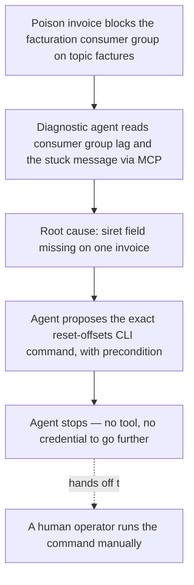
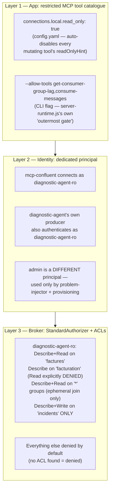

# Kafka Ops Agent Governance — Diagnose, Never Touch

[](https://kafka.apache.org/)
[](https://www.python.org/)
[](https://pypi.org/project/google-adk/)
[](https://github.com/confluentinc/mcp-confluent)
[](https://docs.docker.com/compose/)

This is the third repo in the series — the governance follow-up to
[`kafka-ops-agents`](https://github.com/arabaaoui/kafka-ops-agents) (Article 2), which
had one agent diagnose a poison message blocking a Kafka consumer group, propose the
operator fix, and then — labeled "simulated" but backed by a real, unrestricted
`AdminClient` call — apply and verify that fix itself.

This repo asks the opposite question: **can the same diagnosis run with an agent that is
technically incapable of touching the broker?** Not instructed not to — *unable to*, at
three independent layers, so that even a prompt-injected or buggy agent fails safe.

> Companion articles: [Quand un agent IA diagnostique votre Kafka — et vous laisse
> corriger](https://kafblog.dolizone.com/blog/kafka-agents-ops-loop/) (Article 2) ·
> [Kafka remplace vos middlewares — une supply chain de 200 magasins pilotée par 3 agents
> IA](https://kafblog.dolizone.com/blog/kafka-agents-supply-chain/) (Article 1)

---

## What changed from Article 2

Article 2's agent did more than diagnose: `apply_fix_simulated()` called
`AdminClient.alter_consumer_group_offsets()` for real, against a broker running with no
auth and no ACLs (`auth.disabled: true`, everything `User:ANONYMOUS`, full rights). There
was nothing stopping the agent from doing that itself.

This repo removes that capability rather than gating it:

| | Article 2 | This repo (Article 3) |
|---|---|---|
| Diagnose root cause | yes | yes |
| Propose the exact `--reset-offsets` command | yes | yes |
| **Apply the fix** | yes (`apply_fix_simulated`, real `AdminClient` write) | **no such tool exists** |
| **Verify the fix** | yes (`verify_fix`) | **no such tool exists** |
| Who mutates the broker | the agent itself | a human operator, outside this repo entirely |
| Broker auth | none (`auth.disabled: true`, no ACLs) | SASL/PLAIN + `StandardAuthorizer` + per-identity ACLs |
| MCP tool catalogue | whatever the server ships | restricted to 2 read-only tools |
| Kafka identity | one shared, unauthenticated connection | 2 separate principals: `admin` vs `diagnostic-agent-ro` |

Everything else — the poison-message scenario, `get-consumer-group-lag` +
`consume-messages` as the two real MCP calls, the deterministic-or-LLM diagnosis, the
"LLM optional" fallback — is reused close to verbatim. See [Migration / copy map](#migration--copy-map-from-article-2).

---

## Use Case: A Poison Message Blocks Billing (unchanged from Article 2)

An upstream producer bug drops the `siret` field from one invoice. The `facturation`
consumer group reads it, crashes parsing the missing field, and disconnects **without
committing** — so it refetches the exact same message on every restart. The committed
offset freezes; the lag climbs with every new invoice behind it.



---

## Defense in depth

Three independent layers, so that even a prompt-injected or buggy agent fails safe.
Every claim about the official server below is verified against the installed
`@confluentinc/mcp-confluent@1.5.0` package source (`npm pack`'d and read locally, plus
the matching `v1.5.0` tag on GitHub for files the npm tarball excludes) — not assumed
from memory. Citations are file paths inside that package.



### Layer 1 — restricted official MCP tool catalogue (no custom server, no proxy)

Verified two independent, **native** mechanisms in `@confluentinc/mcp-confluent@1.5.0` —
no fork, no custom MCP server, no proxy in front of it:

1. **`connections.<id>.read_only: true`** (`mcp-confluent/config.yaml`). From the
   package's own `config.example.yaml`: *"With `read_only: true`, every tool that
   mutates state is auto-disabled for this connection — only read-only tools stay
   enabled (a tool's posture comes from its `readOnlyHint` annotation)."* Confirmed in
   `dist/confluent/tools/handlers/kafka/get-consumer-group-lag-handler.js` and
   `consume-kafka-messages-handler.js`, both of which set `annotations: READ_ONLY` in
   their `getToolConfig()`.
2. **`--allow-tools <tools>`** (`docker-compose.app.yml`'s `mcp-confluent` command).
   `dist/cli.js` defines `--allow-tools`/`--block-tools`/`--allow-tools-file`/`--block-tools-file`,
   explicitly documented as combinable with `--config`. `dist/server-runtime.js`'s own
   comment calls the resulting allow-list *"the operator's allow/block-list"*, and
   `tool-availability.js`'s `buildToolGatingReport` checks `runtime.isToolAllowed(toolName)`
   **before** any per-connection predicate — "the filter is the outermost gate."

Both are enabled here, deliberately redundant: `read_only: true` would already drop
`produce-message` / `create-topics` / `delete-topics` / `alter-topic-config` on its own;
`--allow-tools get-consumer-group-lag,consume-messages` additionally makes every *other*
tool in the catalogue (including read-only ones this scenario doesn't need, and every
Confluent-Cloud-only tool that can't reach a local broker anyway) unreachable, regardless
of connection settings. `tests/test_tool_catalogue.py` checks the outcome live.

**Limitation, stated precisely:** both mechanisms are real and were verified from source
rather than assumed — this repo did not need to fall back to a custom proxy. If a future
`mcp-confluent` release removed both, the fallback the approved plan described (a
transparent JSON-RPC filter with no Kafka protocol knowledge of its own, forwarding
everything to the real server) was deliberately **not** built, per this iteration's
instruction to rely on the broker ACL as final enforcement instead. Layer 3 does not
depend on Layer 1 at all — see below.

### Layer 2 — dedicated agent identity

`diagnostic-agent-ro` is the *only* Kafka identity `mcp-confluent` and the diagnostic
agent's own direct producer ever use (`docker-compose.app.yml`). `problem-injector` and
all provisioning (`kafka-init`, `kafka-acl-init`) run as `admin`, a distinct principal.
The diagnostic-agent container's environment carries no `admin` credential of any kind —
there is nothing in that container capable of authenticating as `admin`.

### Layer 3 — broker-level authorization (the layer that actually enforces)

`docker-compose.test.yml`'s `kafka` service runs SASL_PLAINTEXT/PLAIN with
`org.apache.kafka.metadata.authorizer.StandardAuthorizer`, `super.users=User:admin`, and
`allow.everyone.if.no.acl.found=false` — nothing granted is denied by default.
`kafka/init-acls.sh` grants `diagnostic-agent-ro` exactly:

| Resource | Permission | Operation | Why |
|---|---|---|---|
| Topic `factures` | ALLOW | Describe, Read | `consume-messages`' real Fetch; `get-consumer-group-lag`'s topic metadata/watermark lookup |
| Group `facturation` | ALLOW | Describe | `get-consumer-group-lag`'s `admin.fetchOffsets({groupId})` — OffsetFetch without joining the group |
| Group `*` (literal wildcard, i.e. **every** group) | ALLOW | Describe, Read | see note below |
| Group `facturation` | **DENY** | Read | overrides the wildcard ALLOW above for this one group — see note below |
| Topic `incidents` | ALLOW | Describe, Write | the one deliberate exception — the agent's own diagnosis report |

Nothing else is granted: no Write on `factures`, no Create/Delete/Alter on any topic, no
Alter/Delete on any group, no cluster-level operation. This is what would have stopped
Article 2's `apply_fix_simulated()` even if it had somehow still been present in the
code — `tests/test_denied_mutations.py` proves it by making that exact call.

**Why the group grant is the literal wildcard `*` (any group), plus an explicit DENY
carve-out for `facturation`, stated precisely — this is the one unavoidable constraint in
this repo's ACL design, not glossed over:** reading
`dist/confluent/tools/handlers/kafka/consume-kafka-messages-handler.js` shows
`consume-messages` joins a real consumer (`subscribe` + `run`) using
`groupId: nodeCrypto.randomUUID()` — a fresh random group id on every call. There is no
fixed group name, and no shared prefix, to scope a tighter ACL to: the official tool's
implementation leaves no narrower resource pattern to grant against. A wildcard ALLOW is
therefore unavoidable if `consume-messages` is to work at all under this identity.

That wildcard, on its own, would have been a real least-privilege violation: it grants
Read on *every* group name, including the literal `facturation` — and Read on a Group
plus Read on a Topic is exactly what Kafka's `OffsetCommit` protocol requires, which is
what `AdminClient.alter_consumer_group_offsets()` (Article 2's `apply_fix_simulated()`
call) is built on. Combined with the Read already granted on topic `factures`, the
wildcard alone would have silently re-authorized the exact mutation this repo exists to
block. The fix is the explicit `DENY Read` on `facturation` in the table above: a Kafka
DENY ACL always wins over a matching ALLOW regardless of which is more specific (documented
core `StandardAuthorizer` behavior, not a pattern-specificity trick), so `facturation`
loses the Read the wildcard would otherwise grant while every *other* — ephemeral,
random-UUID — group name stays fully covered by the wildcard ALLOW. `facturation`'s
separate Describe grant is untouched, so `get-consumer-group-lag` keeps working.
`diagnostic-agent-ro` can still transiently join and read arbitrary *other* group names
(a residual side effect of the wildcard being the only way to satisfy `consume-messages`
at all); it commits to none of them regardless, since `enable.auto.commit` is hardcoded
`false` in `direct-client-manager.js`.

---

## Tests

### Positive path — offline, no Docker (`make local-test`)

`tests/test_deterministic_flow.py`: pure-function and mocked-producer tests proving the
diagnosis logic — poison-message detection, root-cause text, the proposed
`--reset-offsets` command, burst-vs-isolated classification, publication to `incidents`
only. Also asserts **structural absence**: `DiagnosticTools` has no
`apply_fix_simulated`, `verify_fix`, or `_catch_up_simulated` method, and its constructor
takes no `AdminClient` — the capability isn't hidden or unused, it doesn't exist in this
codebase.

### Negative path — live, requires the Docker stack

`tests/test_denied_mutations.py` (`make test-negative`, or `make demo-denied` for the
full scripted run): connects **directly** to the broker as `diagnostic-agent-ro` —
bypassing the application and MCP entirely — and asserts the broker itself rejects:
producing to `factures`, creating a topic, deleting `factures`, altering
`facturation`'s committed offsets (the exact call Article 2's agent used to make), and
deleting the `facturation` group. Positive controls in the same run confirm writing to
`incidents` and reading `facturation`'s lag still work — proving the ACLs are scoped, not
a blanket deny.

`tests/test_tool_catalogue.py` (`make test-catalogue`) calls the live MCP server's
`tools/list` and asserts the advertised set is exactly `{get-consumer-group-lag,
consume-messages}`.

Both live tests skip cleanly (exit 0) if the stack isn't reachable, the same pattern
`mcp-confluent`'s own `@cp`-tagged integration tests use when their env vars are unset.

---

## Quickstart

```bash
cp .env.example .env      # optional: set DIAGNOSTIC_LLM_API_KEY, or leave empty
make test-stack           # broker + SASL identities + ACLs + topics
make demo-diag            # seed the scenario, diagnose, publish, stop
make demo-denied          # prove the same identity's mutations are denied
```

Kafka UI at <http://localhost:8081>. `make check` for a pipeline snapshot (consumer
group state, message counts, `diagnostic-agent-ro`'s live ACL bindings).

The broker publishes two listeners: `kafka:9093` (advertised for containers on the
compose network — mcp-confluent, the agents, kafka-ui, kcat all use this one) and
`localhost:9095` (advertised for the host — used only by `tests/test_denied_mutations.py`
and `scripts/demo-denied.sh`, which deliberately run from outside any container to prove
the broker enforces the boundary independent of the application). A single advertised
listener naming the internal `kafka` hostname would work for the initial bootstrap from
the host but break on the client's first reconnect (Kafka clients reconnect to whatever
the broker advertised, and `kafka` doesn't resolve outside the Docker network) — hence
the second listener rather than reusing 9093 for both.

### Evidence commands (for the article)

These are the exact reproducible commands; **no output below is fabricated** — this
environment has no Docker daemon available to run them (see
[Docker availability on this host](#docker-availability-on-this-host)), so run them
locally and paste the real output when writing the article.

```bash
# ACL bindings actually in force for diagnostic-agent-ro
docker compose -f docker-compose.test.yml exec kafka \
  /opt/kafka/bin/kafka-acls.sh --bootstrap-server kafka:9093 \
  --command-config /etc/kafka/admin.properties \
  --list --principal User:diagnostic-agent-ro

# The MCP server's advertised tool catalogue
python3 tests/test_tool_catalogue.py

# The denied-mutation transcript (raw Kafka authorization exceptions)
python3 tests/test_denied_mutations.py

# The diagnostic agent's own startup self-audit of the tool catalogue it sees
docker compose -f docker-compose.app.yml logs diagnostic-agent | grep -i "tool catalogue"
```

---

## Project Structure

```
kafka-ops-agent-governance/
├── .env.example
├── .gitignore
├── docker-compose.test.yml           # Kafka (SASL/PLAIN, StandardAuthorizer, ACLs) + Kafka UI
├── docker-compose.app.yml            # mcp-confluent (restricted) + problem-injector (admin) + diagnostic-agent (agent)
├── Makefile
├── kafka/
│   ├── admin.properties              # local-dev SASL client config, admin identity
│   ├── agent.properties              # local-dev SASL client config, diagnostic-agent-ro identity
│   └── init-acls.sh                  # grants diagnostic-agent-ro its minimal ACLs
├── mcp-confluent/
│   └── config.yaml                   # official server config: read_only connection + SASL creds
├── scripts/
│   ├── demo-diag.sh                  # poison message -> diagnosis -> proposed fix -> stop
│   └── demo-denied.sh                # live proof of denied mutations
├── tests/
│   ├── test_deterministic_flow.py    # offline positive path + structural absence checks
│   ├── test_denied_mutations.py      # live negative path (broker ACLs)
│   └── test_tool_catalogue.py        # live MCP tools/list check
└── agents/
    ├── Dockerfile.agent
    ├── common/
    │   ├── config.py                 # env-driven config, per-identity SASL client config
    │   ├── adk_factory.py            # LiteLLM-backed google-adk Agent factory + runner
    │   ├── mcp_client.py             # MCP Confluent HTTP/SSE client + tools/list self-check
    │   └── requirements.txt
    ├── problem_injector/
    │   └── app.py                    # one-shot seeding, runs as `admin`
    └── diagnostic/
        ├── agent.py                  # one-shot: diagnose, publish, exit — no mutation tools
        └── prompts.py                # observation-only mandate
```

---

## Migration / copy map from Article 2

| File | Action | Notes |
|---|---|---|
| `LICENSE` | kept as-is | same author/license |
| `.env.example` | extended | two SASL passwords instead of Kafka-side auth being absent |
| `Makefile` | extended | dropped fix-loop references in `check`; added `test-negative`, `test-catalogue`, `acl-init`, `demo-denied` |
| `docker-compose.test.yml` | rewritten | SASL/PLAIN + `StandardAuthorizer` + `kafka-acl-init`; dropped the `alerts`/`kcat` topic list to `factures`/`incidents` only |
| `docker-compose.app.yml` | rewritten | split `admin` vs `diagnostic-agent-ro` credentials per service; pinned `mcp-confluent@1.5.0` with `--allow-tools` |
| `mcp-confluent/config.yaml` | rewritten | added `read_only: true`, SASL `auth`/`extra_properties` block |
| `scripts/demo-diag.sh` | trimmed | dropped the "fix simulé" / "vérification" sections |
| `tests/test_deterministic_flow.py` | trimmed + extended | dropped fix/verify test blocks; added structural-absence assertions |
| `agents/Dockerfile.agent` | copied verbatim | no change needed |
| `agents/common/adk_factory.py` | copied verbatim | no change needed |
| `agents/common/requirements.txt` | copied verbatim | `confluent-kafka` still needed (problem-injector, negative tests) |
| `agents/common/config.py` | rewritten | dropped `VERIFY_FIX_DELAY_S`/`CATCHUP_TIMEOUT_S`/`TOPIC_ALERTS`; added per-identity SASL config |
| `agents/common/mcp_client.py` | extended | added `list_tools()` for the self-audit and catalogue test |
| `agents/problem_injector/app.py` | adapted | uses `admin` SASL identity via shared `kafka_client_config()` |
| `agents/diagnostic/agent.py` | rewritten | removed `AdminClient`, `apply_fix_simulated`, `verify_fix`, `_catch_up_simulated`; removed the `alerts`-listener main loop in favor of a one-shot run |
| `agents/diagnostic/prompts.py` | rewritten | observation-only mandate |
| `SPEC.md` | not reintroduced | Article 2 itself deleted it; kept in this README instead |

---

## Docker availability on this host

This implementation was built and reviewed on a host with the Docker **CLI** installed
but no `dockerd` daemon (`/var/run/docker.sock` absent, no `dockerd` binary, no root/sudo
to install or start one). As a result:

- **Ran here (passed):** `python3 tests/test_deterministic_flow.py` (5/5, offline, no
  Docker); `python3 -m py_compile` across every `.py` file in the repo;
  `docker compose -f docker-compose.test.yml config` / `-f docker-compose.app.yml config`
  (validates and fully interpolates both Compose files, including the per-listener SASL
  JAAS blocks, without a running daemon); `bash -n` on every shell script.
- **Ran here (confirmed correct skip behavior, no live broker/MCP server available):**
  `python3 tests/test_denied_mutations.py` and `python3 tests/test_tool_catalogue.py` —
  both connect, fail to reach anything at `localhost:9095` / `localhost:3002`, print a
  clear reason, and exit 0 rather than failing or hanging, exactly as designed for a
  Docker-less host.
- **Could not run here:** `docker compose -f docker-compose.test.yml up`,
  `docker compose -f docker-compose.app.yml up`, the actual (non-skip) assertions inside
  `tests/test_denied_mutations.py` / `tests/test_tool_catalogue.py` against a real broker,
  `scripts/demo-diag.sh`, `scripts/demo-denied.sh`. All of the SASL/ACL/MCP configuration
  these depend on was verified by reading the actual `apache/kafka:4.2.1` image's
  env-var-to-property source (`kafka.docker.KafkaDockerWrapper` in the Apache Kafka repo)
  and the actual installed `@confluentinc/mcp-confluent@1.5.0` package source, not by
  running them end-to-end — see the source citations throughout this README and the
  inline comments in `docker-compose.test.yml` / `mcp-confluent/config.yaml`. In
  particular, the DENY-ACL fix in `kafka/init-acls.sh` (see the Layer 3 ACL table above)
  is reasoned from Kafka's documented authorization model (`OffsetCommit` requires READ on
  Group + READ on Topic; a DENY ACL always wins over a matching ALLOW) rather than
  empirically confirmed against a live broker. Run `make test-stack && make demo-diag &&
  make demo-denied` on a host with a working Docker daemon to validate and capture the
  real evidence transcripts, including confirming this specific fix denies
  `alter_consumer_group_offsets('facturation', ...)` as intended.

## Requirements

- **Docker** 24+ with Docker Compose v2, and a running daemon.
- **Python 3.11+** with `confluent-kafka`, `httpx`, `python-dotenv`, `google-adk`,
  `litellm` for local (non-Docker) test runs.
- **`DIAGNOSTIC_LLM_API_KEY` is entirely optional** — the diagnostic pass runs
  deterministic with zero keys configured.

## License

MIT
